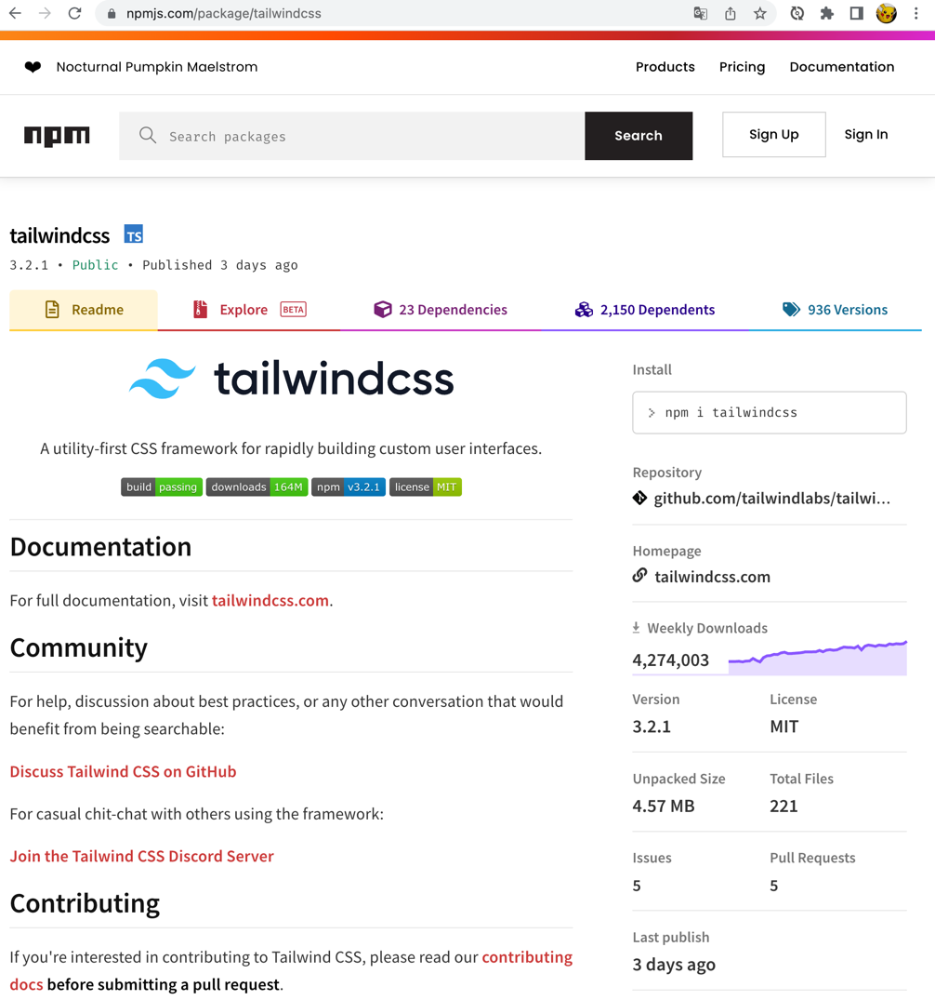
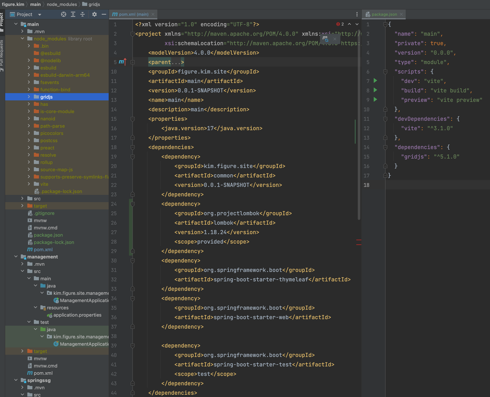
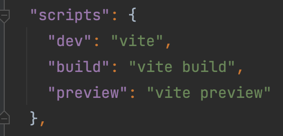
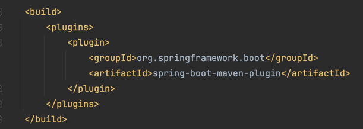

# Java 개발자를 위한 npm, js 번들러 설명
## 부제 : 파편화된 JS생태계한테 후두려 맞은 Java 서버 개발자에게 npm, 번들러를 이해시키는 글

> 대상 독자
> - jsp 또는 thymeleaf로 view를 구성하고 js 라이브러리는 CDN 이나 직접 serving을 통해 `<script>` 태그로 직접 호출해서 사용해 왔는데 css 후처리기, 바벨이니 린트니 `import`, `require()` 같은 것들을 사용하려고 하니 다 모던프레임워크 예제만 있고 등장하는 단어 하나하나가 다 새로워서 빨리 돌리고 싶은데 이거 검색하고 저거 검색하다 지쳐서 결국 레거시 패턴을 답습하거나 포기하고싶은 사람
> - Java 백엔드 개발자지만 어쩌다보니 프론트엔드 인력이 속한 팀, 프로젝트의 팀장, PM을 맡게 됐는데 프론트엔드 지식은 jquery, bootstrap, jsp정도가 다라서 막막한 사람

> 정확한 정보 전달을 욕심내면 심플함을 잃어버릴수 있어 정확성을 일부 포기하고 구어체로 전달하고자 한다.

## npm : Node Package Manager
npm은 Node Package Manager 정도로 이해하면 된다. (정작 npm document에는 약자 언급은 없다. 그냥 npm은 npm이라는게 오피셜인것같다.)  
Java 진영에서 사용하는 Maven으로 생각하면 되는데 자바 개발자가 모던 프론트 트렌드를 모르는 상태에서 npm을 접하게 되면 이런 생각을 하게된다.

> Node? 나 노드는 안쓸건데 npm을 써야해? 노드 서버 돌릴때나 쓰는거 아니야? 노드 서버 안띄우면 뭐 모던한거 못쓰는거야?

**응 서버 안돌려두 돼~ 근데 노드는 설치해야 해~**  

npm이 노드의 의존성관리를 package.json파일을 통해 수행하는데 고전적 자바에서도 특정 디렉토리에 jar를 직접 위치시키고 호출해서 사용이 가능하지만 의존성들을 체계적으로 관리하고 빌드를 명령에 의해 체계적으로 수행하기 위해서 Maven을 사용하듯이 node에서는 npm을 사용한다.  
마침 우리가 사용할 웹 브라우저또한 JS를 사용하고있기 때문에 브라우저에서의 library들 또한 npm을 지원하기 시작했고 일종의 국룰이 된 것이다.  
우리가 의존성 추가를 위해 [mvenrepositry](https://mvnrepository.com)에서 검색을 하고 maven gradle에 추가할 내용을 참고하듯이 npmjs.com에서 검색하고 의존성 추가 방법을 참고한다.
  

차이가 있다면 maven에서 의존성 추가는 pom.xml에 마크업을 추가하고 싱크를 맞추는 패턴이 국룰이라면 npm은  직접 package.json에 추가하거나 cli로 `$ npm install tailwindcss` 와 같이 실행하면 pacakge.json도 업데이트가 된다.  

### package.json : Maven의 pom.xml 

  
package.json의 dependency와 devDependency는 pom.xml의 dependency 스코프간 차이와 아주 같지는 않지만 유사한 성격이있다. test, provided의 경우 배포시에 빠지듯이 최종 결과물에 포함이 되냐 안되냐를 결정하는데  
간단하게 생각하면
- 런타임에 작성한, js코드에서 참조하는 의존성은 dependency에 
- css후처리기 등 런타임에는 사용되지 않는 의존성이라면, production에서는 필요 없는 의존성이라면 devDependency에
  
추가하면 된다. (좀더 정확히 말하자면 --production 플래그가 있으면 devDependency의 내용은 포함되지 않는다. 근데 이 내용은 잠시 잊고 있어도 된다.)

#### mvn install ≒ npm install  
`mvn install`을 통해 pom.xml에 있는 디펜던시 정보들을 통해 원격 레포지토리의 디펜던시를 로컬 리포지토리로 추가하고 의존성을 추가하듯 `npm install` 명령어를 통해 dependency를 `node_modules`에 설치한다. 

#### mvn install ≠ npm install    
메이븐에서는 install액션은 package명령을 포함한다. 그래서 install 명령어로 빌드도 하고 컴파일도 하고 패키징도 하는데 npm은 아니다. `npm install`은 위에서 설명한 것 처럼 로컬로 의존성들을 설치하는 기능이 주된 기능이라고 보면된다. 그럼 컴파일, 빌드 등등은 어떻게 할까?

#### mvn spring-boot:run -> npm run dev,  npm run build 
spring-boot를 사용하면 `<build><plugins>`하위에 플러그인을 추가하고 빌드 과정에서 필요한 내용들을 추가할 수 있다. 이런 플러그인을 통해서   

npm run xx를 통해서 package.json의 scripts에 작성된 스크립트를 실행하는데 대체로 `npm run build`를 통해 빌드를 한다. script의 내용은 입맛에 맞게 작성하게 되는데 사용하는 번들러에 따라 달라진다고 보면된다. 

## NPM과 번들러

