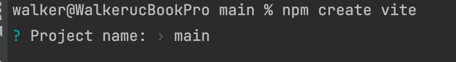
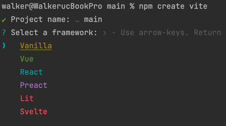
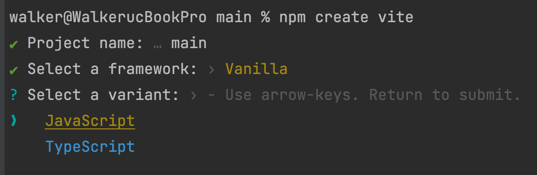
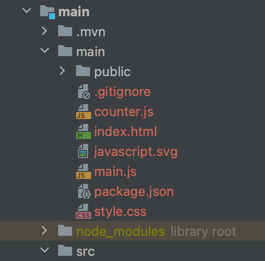
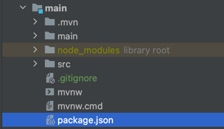
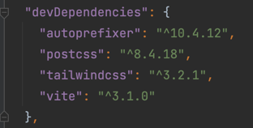
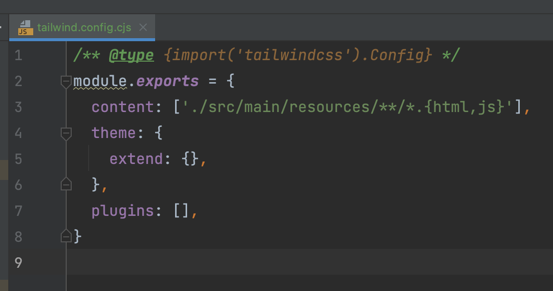
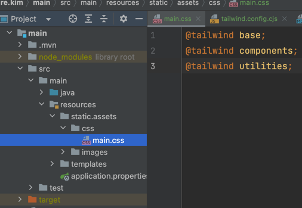

# Spring + Thymeleaf에서 js 번들러(Vite), Tailwind CSS 사용하기
thymeleaf를 사용하면 번들러 없이 고전적인 방법으로 js를 사용하는 경우가 대부분이다.
이런 경우 모던 자바스크립트, js의존성 관리, css후처리 등을 사용할 수 없기 때문
> 아...나는 천생 Java 서버 개발자고...  
> 프론트는 회사에서 누가 칼들고 협박해서 억지로 하...는건 아니고 관심은 좀 있으니까 jsp 경험이나 Thymeleaf사용은 하는데...  
> 요즘 프론트는 3대장중 하나를 다 익혀햐 하는데...  
> 러닝커브 소화는 귀찮고... 모던한 ES6 문법이나 체계적인 의존성 관리, css전,후 처리기 같은것들을 사용하고 싶은데...   

라는 사람을 위한 글이다. 다른 포스팅을 검색하다 보면  

> **마** 나도 개발자고! Jquery도 하고! $.ajax도 하고! 부트스트랩도 하고! **마** 다해봤는데!    

뭔소린지 알아 들을수도 없는 CommonJS니 번들러니 바벨이니하는 단어들이 등장하면서 검색하다가 시간 날리고 아... 다음에 하자...하면서 CDN이나 긁어오던가 사용하지도 않는 클래스관련 CSS 풀 패키지로 serving하고 찝찝함은... 그래 나는 서버개발자니까.. 라고 생각을 반복했을 것이다.  
이런 역사를 반복하지 않기 위해서 이 글에서는 최대한 간결하게 필요한 정보만 전달하도록 애써볼 것이다. 너무 많은 정보는 앞의 액션을 되풀이하게 할 것이기 때문에...  

고전적인 Java Servlet SSR 환경에서도 SCSS, import 구문, 의존성 관리 하고싶다는 생각이 들고 webjar라고 하는 좋은 수단을 찾아서 나름 의존성도 타이트하게 관리하고 해봤겠지만 분명 한계를 느끼고 있을것이다...  그래도 한계를 느껴 봤다면 프론트에 조금은 재미를 느끼는 서버 개발자인것 같은데 시간날때 Svelte를 해보길 추ㅊ... 

이 글에서는 Spring MVC + Thymeleaf + Vite를 init하는 방법과 PostCSS, tailwind를 사용한 개발 환경 구축과 thymeleaf 개발을 위해 live-reload등의 백엔드 설정을 알아본다.
Vite가 뭔지 번들러가 뭔지 헷갈리는 자바 개발자는 TODO[Java 개발자를 위한 npm, js 번들러 설명](TODO)을 먼저 읽어봐보쟈~
Vite를 죽어도 안쓰겠다는 지조있는 서버 개발자라도 개념을 이해하는데는 이 글이 충분한 기능을 할 것이다. Vite부분대신 webpack이든 rollup.js든 대신 사용하는 방법을 찾아 적용해보자. 내가 Vite를 쓰는 이유는 빨라서도 있지만 프론트를 분리해서 개발해야 할때 사용하는 framework가 Svelte인데 Svelte Kit이라는 프레임웍에서 채택하고 있는 기본 번들러가 Vite라서 겸사 겸사 사용하려고 쓰는것이다.
노드는 설치 되어있다고 가정하고 진행한다.

### 글을 쓰는 중간에 추가하는 내용
Vite를 직접 적용하면서 글을 작성했는데 생각보다 난이도가 꽤 있었다.  
개발과정의 컴파일 속도는 참을수 있다면 차라리 gulp와 같이 task핸들러를 적용하는게 어쩌면 더 나은 선택이 아닌가 싶다.
import 든 require()와 같은 방식으로 의존성을 추가한 각각의 js들의 의존성을 추가해 컴파일 하는 일련의 작업들은 gulp 같은 task 핸들러의 경우 특정 디렉토리를 감시하고 변경 사항이 있을때 컴파일을 시키는 방식으로 간단히 작업이 가능하지만 (변경 사항이 있을때마다 컴파일 하고 그 컴파일속도도 느리기 때문에 개발간 답답한 면이 있긴함) Vite의 경우 간단히 위와같은 작업만 수행하기에는 프로세스가 모던 프레임워크의 릴리즈 과정과 강결합 되어있어 부득이 앱의 개발 프로필과 프로덕션 프로필을 분리하고 


## TL;DR
<details>


package.json을 프로젝트 루트에 작성  
**package.json**
``` json
{
  "name": "main",
  "private": true,
  "version": "0.0.0",
  "type": "module",
  "scripts": {
    "dev": "vite",
    "build": "vite build",
    "preview": "vite preview"
  },
  "devDependencies": {
    "vite": "^3.1.0"
  }
}
```
package.json이 있는 경로에서 다음을 터미널에서 실행

```shell
$ npm install
-> 의존성 다운로드
$ npm install -D tailwindcss postcss autoprefixer
-> tailwindcss, postcss, autoprefixer 개발 의존성으로 설치
$ npx tailwindcss init
-> tailwind.config.cjs 파일이 생성됨
```
동일 경로에 postcss.config.cjs파일 생성  
**postcss.config.cjs**
```js
module.exports = {
  plugins: {
    tailwindcss: {},
    autoprefixer: {},
  }
}
```


</details>

---
## Vite?
정보의 홍수에서 고달파할 서버 개발자를 위해 억지로 간단 요약을 해본다면 우리가 흔히 아는 모던 프론트엔드 프레임워크는 
vite 공식 홈페이지의 getting started를 보면 새 프로젝트를 init하는 방법만 소개하고 있다.

우리는 Spring + Thymeleaf 프로젝트에 vite를 적용하고자 하는데 getting started에서 소개하는 **npm create vite** 를 싫행하면 프로젝트 명을 묻고 프레임워크와 js/ts를 선택할 수 있다. 

프로젝트 이름을 입력하면 해당 프로젝트 이름의 디렉토리를 자동 생성하고 내부에 여러 파일들을 생성한다.  
```shell
$ npm create vite
```


Thymeleaf에서 사용할 것이므로 Vanilla를 선택  


본인은 javascript로 진행한다.  


생성된 여러 파일등 중에서 package.json만 복사한 뒤 패키지 루트에 붙여넣고 해당 디렉토리는 삭제시킨다. (우리는 vanilla js를 이용한 static사이트를 만드는게 목적이 아니라 thymeleaf와 함께 사용할 예정이므로 나머지는 불필요하다.)



우리는 package.json만 있으면 된다.
즉 위의 init액션들을 수행하지 않고 프로젝트 루트에 package.json을 생성하고 다음의 내용을 붙여넣어도 무방하다.  
**package.json**
``` json
{
  "name": "main",
  "private": true,
  "version": "0.0.0",
  "type": "module",
  "scripts": {
    "dev": "vite",
    "build": "vite build",
    "preview": "vite preview"
  },
  "devDependencies": {
    "vite": "^3.1.0"
  }
}
```
기본 설정으로 사용할거면 이 상태에서  `npm install`후에 npm run dev 라든지 run build를 사용하면 되겠지만 번들링 설정을 적용하기 위해 package.json과 같은 위치에 `vite.config.js`파일을 생성한다. 설정에 관한 자세한 내용은 [공식 doc](https://vitejs-kr.github.io/config/)을 참고
파일의 내용은 일단 TODO
## Tailwind CSS with PostCSS 설치
포스트 모더니즘은 모더니즘 이후의 사조를 말한다. 이처럼 post는 어떤것 이후를 의미하는데 PostCSS라는 명칭에서 알 수 있듯이 css후처리를 위한 도구라는 것을 알 수 있다. 그대는 서버 개발자기 때문에 후처리를 어떤식으로 하는지 구렁이 담넘어가든 설명해놓은 다른 프론트엔드 개발자들의 포스팅을 보고 답답함을 느꼈을 것이다. 다른 공식문서들을 봐도 프론트 개발자들은 그냥 뭔가 당연하다는듯이 기술하고 넘어가더라... 그렇다고 여기서 답답함을 해소시켜주진 않을 것이지만 그래도 보다보면 얻어가는건 있을것이다.  

Lombok이나 Querydsl, MapStruct 등을 사용한다면 내가 에노테이션을 달거나 인터페스만 생성하거나 작성한 코드를 기준으로 QClass를 생성하는 등의 내가 하지도 않은 class들이 build타임에 생성되는 것을 알고 있을 것이다.  
PostCSS와 같은 css후처리, nodejs스타일로 작성한 javascript를 브라우저가 이해하도록 바꿔버린다거나 하는 행위들이 비슷한 과정이라고 생각하면 된다.  
@Getter를 작성했지만 결국 컴파일 결과물에는 클래스 내의 getter가 생성된 것 처럼 모던 Javasacript 프로젝트에는 아주 기본적으로 이런 것들을 국룰처럼 수반한다.  
PostCSS가 뭔지 autoprefixer가 뭔지는 다른곳에서 검색해서 알아보시고 중요한건

**이 글에서는 Tailwind CSS를 PostCSS의 플러그인으로 사용할 것이라는 것이다.**  

단순히 Tailwind CSS만 사용하고 말 것이라면 모르겠지만 PostCSS가 국룰이니까 이 테크를 타길 바란다. 나중에 PostCSS의 다른 플러그인들을 분명 쓰게 될 것이기 때문이다. [Talilwind CSS doc](https://tailwindcss.com/docs/installation/using-postcss)에서도 PostCSS를 사용할때는 autoprefixer를 같이 설치하도록 안내하고 있다. 

[Talilwind CSS doc](https://tailwindcss.com/docs/installation/using-postcss) 가이드를 따라서 다음을 실행한다.
```shell
$ npm install -D tailwindcss postcss autoprefixer
```  
tailwindcss와 postcss와 autoprefixer를 devDependency로 추가하라는 의미(-D)로 package.json파일의 devDpendency에 각각의 디펜던시 정보 리터럴이 추가되고 node_modules에 설치된다.  



```shell
$ npx tailwindcss init
```  
npx는 또 뭐냐 싶겠지만 자세한건 나중에 익숙해지면 찾아보시고 x -> execute 로 Tailwind CSS에서 미리 작성해놓은 일련의 작업을 실행시킨다고 이해하면된다.(npm에서 지원하는 명령)
이 작업을 통해 package.json과 동일한 경로에 `tailwind.config.cjs`가 생성된다. 이 파일은 Tailwind CSS와 관련된 설정들을 할 수 있는 파일로 커스텀 색상, 커스텀 클래스 등 실제 사용할 때 만질 일이 많을 것이다. 

[공식문서](https://tailwindcss.com/docs/configuration)에서는 `tailwind.config.js`가 생성된다고 써있는데 왜 `tailwind.config.cjs`가 생성되었는지 의아할 수 있다. 뭐가 잘못된건 아닌지 js랑 cjs차이가 뭔지 당장 검색을 하고 싶겠지만 우리가 생성한 Vite프로젝트가 ESM 프로젝트라서 그렇다 정도만 이해하고 넘어가자...관련 이야기는 [뒤에 (CommonJS vs ESM)](#commonjs-vs-esm) 나온다.  

postcss.config.cjs 파일을 생성하고 다음의 내용을 입력한다.
```javascript
module.exports = {
  plugins: {
    tailwindcss: {},
    autoprefixer: {},
  }
}
```
postcss에서 tailwindcss, autoprefixer plugin을 사용하겠다는 의미이다.


tailwind.config.cjs파일에 content 필드를 입력해야하는데 공식문서에는 `["./src/**/*.{html,js}"]`가 입력되어있는데 우리는 Spring MVC + thymeleaf이므로 우리자 작성할 html, js가 있을 경로인 `'./src/main/resources/**/*.{html,js}'`를 입력한다.  


tailwind는 버전 업데이트가 되면서 purgcss기능을 내부 기능으로 가져왔는데 실제로 사용되지 않는 클래스는 css 컴파일시 제외시키는 기능이다. 주의할 점은 js에서 Element에 대해 className에 +=로 클래스를 추가한다거나 교체하는 방식으로는 트래킹이 되지 않고 classList에서 add 하는 경우만 인지하고 css에 추가한다.

사용된 class들을 위의 기능을 통해 선별하고 그에 맞는 css는 html에서 참조할 어딘가에 적용되어야 한다. 우리는 main.css를 사용할 예정이다. main.css를 각자의 전략에 맞게 생성하고 다음의 내용을 입력한다. 나의 경우는 `resources/static/assets/css/main.css` 에 생성했다.  


가이드에서는 `npm run dev`를 입력하라고 하지만 우리는 아직 postcss설정을 vite에 하지 않았기 때문에 해봤자 빈 서버만 띄워진다.

## 번들러(Vite)에 PostCSS 설정 적용


## CommonJS vs ESM
너무나 파편화된 프론트엔드 지식을 흡수하는데 지친 Java 서버 개발자는 아 앞으로 그냥 표준이니까. ESM으로 쓰면 되는구나 정도만 이해하고 `ESM 문법`이라고 검색해서 친절한 프론트엔드 개발자가 설명한 내용을 보고 사용하면 된다. 우리가 `npm create vite`를 통해 생성한 프로젝트도 ESM이고 package.json의 `"type": "module"` 부분이 ESM프로젝트임을 알려준다. 많은 라이브러리들이 CommonJS방식과 ESM방식()을 모두 설명하고 있기 때문에 지금 뭘 선택해야하나 고민 안해도 된다. 

여유가 있다면 마저 읽어도 좋다.  

나이 좀 먹은 서버개발자들은 jsp에 main.js 작성하고 html에서 필요한 js순서대로 작성하면 아~무문제가 없었기 때문에 js파일을 모듈화 시키고 필요한 부분만 가져다가 쓸 필요성을 못 느꼈겠지만 프론트의 덩치가 커져가면서 개발 효율 및 운영 효율 측면에서 모든 js들을 로드 하면서 개발을 하기에는 관리도 안되고 문제가 한두개가 아니었다.  
그래서 CommonJS라는 조직이 등장해서 `require()` 함수를 사용해 모듈을 사용할 수 있도록(물론 이 이유 때문만은 아니었다.) 일종의 표준적인 명세를 작성했고 너도나도 사용해서 즐거운 소프트웨어 개발을 하게 되었다.  
하지만 Javascript는 ECMAScript라는 표준 규격을 준수해서 만들어진 언어인데 이 ECMAScript에서 ES6를 발표하면서 `import`를 통해 모듈을 사용하는 ESM이라는 모듈체계를 정의했고 표준이 되어버렸다.  
하지만 많은 js라이브러리들은 CommonJS를 따라 작성이 되었다. 우리가 사용하는 Tailwind CSS도 마찬가지다.  
ESM프로젝트는 js파일은 ESM 스펙을 따를 것으로 기대한다. tailwind는 CommonJS로 작성되었고 js파일을 참조 할때도 CommonJS로 작성되었을 것으로 기대하는데 tailwind.config.js로 되어있으면 번들러는 ESM스펙에 맞춰 Tailwind에서 참조하도록 할 것이고 commonjs로 작성되었던 Tailwind CSS에서는 오류가 나게 된다.  
이런 문제 때문에 .cjs파일, .mjs 파일이 등장하는데 cjs는 CommonJS, mjs는 ESM로 작성된 js라는 식별값이고 Tailwind CSS는 `npx tailwindcss init` 명령 실행시 package.json의 type값이 'module'인지를 확인하고 참일 경우 cjs 파일로 생성하도록 하고 있다. [tailwindcss/src/cli.js](https://github.com/tailwindlabs/tailwindcss/blob/5ea752e85c329a9f790b1a09205db4330514ce1a/src/cli.js)


